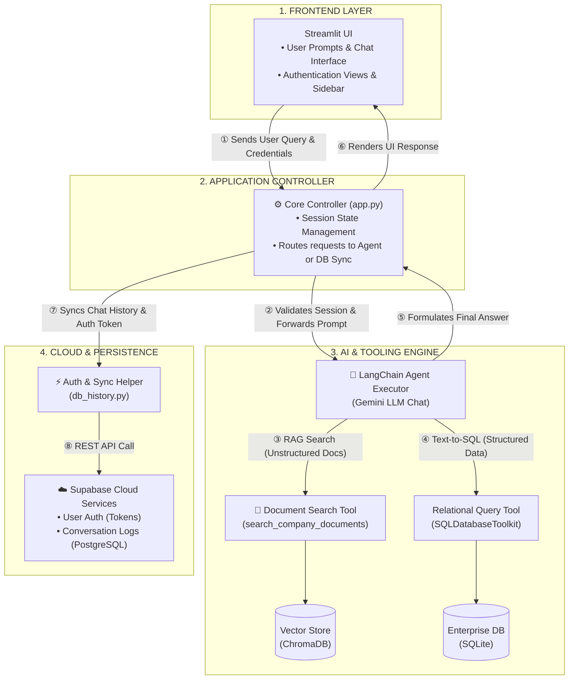

# BizWhisperer

BizWhisperer is an advanced AI Data Agent that bridges the gap between structured databases (like SQLite containing tables of sales, customers, and expenses) and unstructured documents (like PDF policy files, Q2 strategy documents, or company manuals). It combines relational SQL with retrieval-based document search and an LLM-driven workflow to help users get answers from both sources in one place.

## Overview

In many organizations, business information is split across two very different types of data:

- **Structured data** includes tables of sales, customers, expenses, and employee records stored in relational databases.
- **Unstructured data** includes policy manuals, strategic documents, and legal text stored in files such as PDFs.

A common question might involve both of these sources at once. For example, a manager may want to know how much was spent last month and whether an expense policy allows a specific approval path. Traditionally, that required separate work in SQL and document review.

BizWhisperer brings those tasks together into a single conversational experience.

## Architecture

The system is organized around three layers:

1. **User interface**
   - A Streamlit-based experience for chat, forms, and session interaction.

2. **Local backend**
   - The application layer coordinates the agent, runs document search, and queries the local database.

3. **Cloud services**
   - Supabase provides authentication and stores conversation history for secure user access.

## Request and Data Flow

When a user asks a question such as, "What were our Q2 sales, and does policy allow employee travel booking?", the workflow proceeds in a clear sequence:

1. **User input**
   - The question is entered in the app interface and captured in the active session.

2. **Backend setup**
   - The app initializes the agent pipeline and prepares the supporting handlers for the request.

3. **Planning the response**
   - The language model decides which actions are needed, such as checking sales data and reviewing relevant policy documents.

4. **Structured data retrieval**
   - The agent queries the database to gather the relevant numbers and returns the result to the workflow.

5. **Document search**
   - The agent searches the local vector database for the most relevant policy text related to the question.

6. **Answer compilation**
   - The system combines the structured result and document findings into one response.

7. **User-facing update**
   - The final answer is shown in the interface, and the conversation is saved for future access through the cloud-backed history system.
